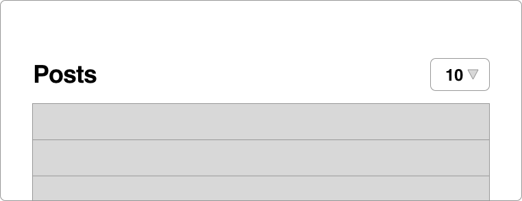

# Settings and Virtual Attributes in Rails Applications

---

## Application-wide Settings

Should be changeable without having to deploy:

* Application Name
* Contact Email
* Google Place ID for map on contact page

---

@title[User Specific Settings]

How about user specific settings?

---

@snap[west span-50]
´
@snapend

@snap[south span-100]
```ruby
change_table :users do |t|
  t.integer :users_per_page, default: 10
end
```
@snapend

---

´
´

```ruby
change_table :users do |t|
  t.integer :users_per_page, default: 10
  t.integer :posts_per_page, default: 30
end
```
