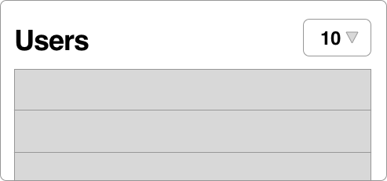
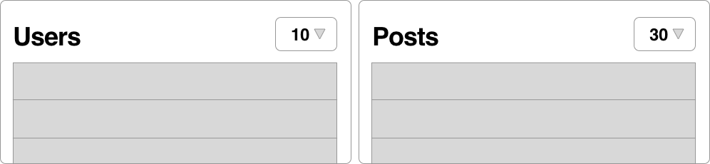

# Settings and Virtual Attributes in Rails Applications

---

@title[Application-Wide Settings]

Application-Wide Settings

---

* Application Name
* Contact Email
* Google Place ID for map on contact page

---

* Application Name
* Contact Email
* Google Place ID for map on contact page

```ruby
create_table :application_settings do |t|
  t.string :name, null: false
  t.string :value, null: false
end

ApplicationSetting.create(name: 'contact_email', 
                          value: 'ulf@example.com')
```

---

@title[User-Specific Settings]

User-Specific Settings

---



---


```ruby
change_table :users do |t|
  t.integer :users_per_page, default: 10
end
```

---



```ruby
change_table :users do |t|
  t.integer :users_per_page, default: 10
  t.integer :posts_per_page, default: 30
end
```

---


```ruby
class User < ApplicationRecord
  DEFAULTS = {users: 10, posts: 30}

  # t.text :view_settings
  serialize :view_settings
end
```

```ruby
User.first.view_settings.try(:[], :users) || 
  User::DEFAULTS[:users]
```

---


```ruby
class ViewCountSetting < ApplicationRecord
end
```

```ruby
class User < ApplicationRecord
  DEFAULTS = {users: 10, posts: 30}

  has_many :view_count_settings
end
```

```ruby
User.first.view_count_settings.find_by(name: :users)&.value || 
  User::DEFAULTS[:users]
```

---

Experimental or Temporary Features

---

@snap[north-west span-50]

@snapend

@snap[north-east span-50]
@box[bg-green rounded]("We need to keep track of user invitations for an upcoming campaign")
@snapend

@snap[south-west span-50]
@box[bg-gold text-white rounded]("We want to test restricting allowed reactions for certain posts")
@snapend

@snap[south-east span-50]

@snapend

---

### The same options again.

* Add new columns to existing tables
* Create new model + table
* Start serializing

---


@fa[arrow-right](Many migrations, a lot of them to be reverted later)
